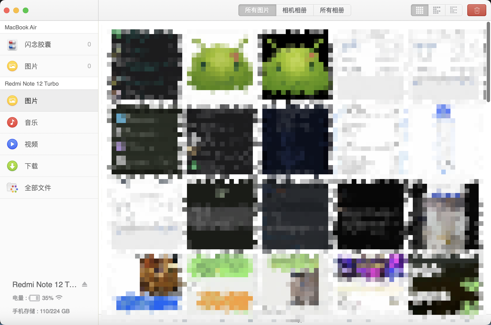

<div align="center">
  

  <h1>HandShaker Mac Maintained</h1>

  <p><strong>面向现代 macOS 的 HandShaker 非官方维护版</strong></p>
  <p>在尽量保留原有连接体验的基础上，修复原版 HandShaker 在新版 macOS 上连接后卡死、内存暴涨与无法稳定使用的问题。</p>

  <p>
    <a href="https://github.com/rianlu/handshaker-mac-maintained/releases/latest">
      
    </a>
    
    
    
  </p>
</div>

> [!IMPORTANT]
> 本仓库是 HandShaker macOS 客户端的非官方维护项目，与原厂无官方关联。仓库内容主要用于个人学习、兼容性分析、逆向修复与非商业研究。详细技术过程可见 [修复报告](docs/HandShaker%20%28Mac%E7%AB%AF%29%20%E8%BF%9E%E6%8E%A5%E5%8D%A1%E6%AD%BB%E4%B8%8E%E5%86%85%E5%AD%98%E6%B3%84%E6%BC%8F%E4%BF%AE%E5%A4%8D%E6%8A%A5%E5%91%8A.md)。

## 相关项目

- Android 端维护版仓库：<https://github.com/rianlu/handshaker-android-maintained>

## 截图预览

<table>
  <tr>
    <td align="center">
      
      <br />
      <strong>修复后的 macOS 端连接与浏览界面</strong>
    </td>
  </tr>
</table>

## 项目亮点

- 修复原版 HandShaker 在现代 macOS 上连接手机后数十秒内卡死、转彩球、内存持续飙升的问题
- 恢复 USB 连接后的文件管理、图片预览和视频浏览等核心能力
- 保留原始桌面端主体结构，适合继续做二进制层面的兼容性维护
- 仓库内置 app 模板、重签名与 DMG 打包流程，方便后续 release 维护

## 当前状态

- macOS 维护版已经可以在当前实测环境下正常连接 Android 手机并稳定使用
- 原版触发卡死的问题点已经定位到“本地同步选项”旧界面
- 维护版通过二进制补丁禁用了该问题界面的显示与初始化逻辑，避免继续触发异常链路
- 连接后的“本地同步选项”自动弹窗已被完全移除，不再显示残留标题栏
- 当前文件浏览、图片预览、视频预览等核心功能已恢复可用
- 设置页面已在维护版中禁用，避免点击后继续触发卡死

## 已实测环境

- macOS 15
- Apple Silicon
- 原版 HandShaker 为 Intel 版本，在 Apple Silicon Mac 上通过 Rosetta 2 运行

> [!NOTE]
> 当前仓库明确实测的是以上环境。其他 macOS 版本、Intel Mac、不同系统安全策略下的表现可能存在差异，请不要默认视为全版本完全一致。

## 下载与使用

### 获取 DMG

- 推荐直接前往 [Releases](https://github.com/rianlu/handshaker-mac-maintained/releases) 页面下载
- 当前最新版本可在 [Latest Release](https://github.com/rianlu/handshaker-mac-maintained/releases/latest) 获取

### 首次打开说明

当前 release 使用本地 ad-hoc 重签名，不包含付费的 Developer ID 签名与 notarization。因此在部分 macOS 环境下，首次打开时可能会遇到系统安全提示。

如果系统阻止打开，可按下面顺序尝试：

1. 在 Finder 中右键应用，选择“打开”
2. 若仍被拦截，前往“系统设置 > 隐私与安全性”，选择“仍要打开”或等效放行选项

## 已修复问题

- 连接设备后数十秒内稳定卡死
- 主线程转彩球并失去响应
- 内存占用持续上涨，最终导致 OOM 或拖死系统
- “本地同步选项”旧界面触发的异常加载链路
- 本地同步选项残留的空白标题栏弹窗
- 文件浏览、图片预览和视频预览等核心功能不可稳定使用的问题

## 修复说明

原版 HandShaker 在现代 macOS 上通常可以启动，也能在手机连接后短暂读出目录结构，但随后会稳定出现主线程卡死和内存无限上涨。

根据进程采样与调用栈分析，真正的触发点并不是 ADB 传输本身，而是连接成功后自动触发的“本地同步选项”旧界面。该界面在现代 macOS 上发生解码异常，异常又进一步触发崩溃捕获逻辑，在 Apple Silicon 的 Rosetta 2 环境下放大为严重的符号解析与字符串分配开销，最终把程序拖进内存暴涨和彻底卡死。

当前维护版的修复方式，是对 `Contents/MacOS/HandShaker` 可执行文件进行 Hopper 二进制补丁，直接禁用问题界面的显示与初始化逻辑，再重新签名并打包为 DMG。

如果你想查看更完整的定位过程、根因分析和补丁说明，可以直接阅读：[HandShaker (Mac端) 连接卡死与内存泄漏修复报告](docs/HandShaker%20%28Mac%E7%AB%AF%29%20%E8%BF%9E%E6%8E%A5%E5%8D%A1%E6%AD%BB%E4%B8%8E%E5%86%85%E5%AD%98%E6%B3%84%E6%BC%8F%E4%BF%AE%E5%A4%8D%E6%8A%A5%E5%91%8A.md)

## 使用注意事项

当前维护版中，设置页面入口已被禁用，用于绕过旧版 `Preference.nib` 在现代 macOS 上的兼容性问题。

当前维护版会直接禁用连接后的“本地同步选项”自动弹窗，不再显示此前遗留的空白标题栏。这不是新的故障，而是为了彻底绕过该旧界面的兼容性问题。这个变化不影响文件浏览、图片预览和视频预览等核心功能。

## 仓库结构

- `App_Template/`：已修复后的 HandShaker.app 模板内容
- `assets/dmg/`：DMG 打包使用的背景图、图标等资源
- `assets/readme/`：README 展示截图
- `build/`：本地构建产物输出目录
- `docs/`：修复报告与相关文档
- `build.sh`：组装 app、重签名并生成 DMG 的脚本

## 开发者说明

### 当前维护方式

- 本仓库不是可直接编译的 macOS 源码工程，而是“二进制修复后的分发维护仓库”
- 核心修复发生在 `App_Template/Contents/MacOS/HandShaker`
- 后续 release 通过脚本重新组装、重签名并打包

### 常用命令

本地重新组装并打包 DMG：

```sh
sh ./build.sh
```

### Release 版本维护

- 版本入口统一在 `release.conf`
- 修改 `RELEASE_SUFFIX` 和 `RELEASE_BUILD_NUMBER` 后，再运行 `sh ./build.sh`
- 维护版版本号会自动写入 app 的 `CFBundleShortVersionString` 和 `CFBundleVersion`
- DMG 构建产物会输出到 `build/`

### 依赖

- `codesign`
- `create-dmg`
- Hopper Disassembler

## 友情链接

- [LINUX DO](https://linux.do/)

社区文化：真诚、友善、团结、专业，共建你我引以为荣之社区。

## 版权与免责声明

- 原始应用及相关商标、名称、资源和版权归原权利人所有
- 本仓库不主张对原始应用本体及其相关知识产权拥有任何权利
- 当前仓库未对整体内容附加通用开源许可证
- 如你计划基于本仓库进行公开分发、商用集成或其他超出个人研究范围的用途，请自行评估相关风险
