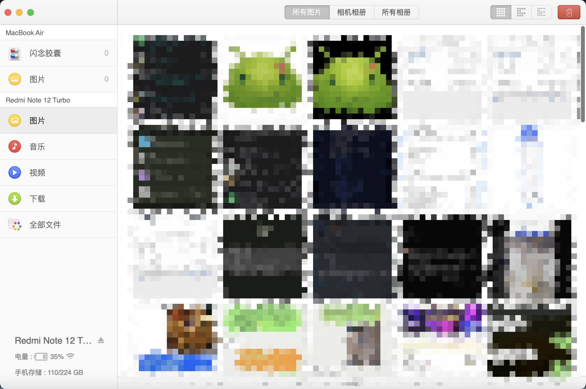

<div align="center">
  
  <h1>HandShaker Mac Maintained</h1>
  <p>面向现代 macOS 的 HandShaker 非官方维护版.</p>
  <p>
    <a href="https://github.com/rianlu/handshaker-mac-maintained/releases/latest"></a>
    
    
  </p>
</div>

> [!IMPORTANT]
> 本项目与 HandShaker 原厂无官方关联, 仅用于兼容性维护, 学习和非商业研究.

## 项目简介

本项目通过二进制补丁维护 HandShaker macOS 客户端, 修复现代 macOS 上连接手机后卡死, 内存持续增长和照片图库加载异常等问题.

<p align="center">
  
</p>

## 功能状态

- 恢复 USB 连接, 文件浏览, 图片预览和视频预览.
- 禁用会触发卡死的"本地同步选项"旧界面.
- 禁用存在兼容问题的设置页面入口.
- 优化照片图库加载, 避免阻塞主线程.
- 提供诊断脚本, 用于收集 USB, Wi-Fi, 进程和系统日志.
- 提供 App 组装, 本地重签名和 DMG 打包流程.

完整定位过程见 [HandShaker (Mac端) 连接卡死与内存泄漏修复报告](docs/HandShaker%20%28Mac%E7%AB%AF%29%20%E8%BF%9E%E6%8E%A5%E5%8D%A1%E6%AD%BB%E4%B8%8E%E5%86%85%E5%AD%98%E6%B3%84%E6%BC%8F%E4%BF%AE%E5%A4%8D%E6%8A%A5%E5%91%8A.md).

## 下载与使用

从 [Releases](https://github.com/rianlu/handshaker-mac-maintained/releases) 下载 DMG. 最新版本见 [Latest Release](https://github.com/rianlu/handshaker-mac-maintained/releases/latest).

1. 打开 DMG, 将 HandShaker 拖入 `/Applications`.
2. 从"应用程序"目录启动 HandShaker.
3. 如果系统阻止打开, 在 Finder 中右键应用并选择"打开".
4. 若仍被拦截, 前往"系统设置 -> 隐私与安全性"并选择"仍要打开".

当前版本使用 ad-hoc 本地签名, 未使用付费 Developer ID 签名和 Apple 公证. 部分受管控设备可能禁止运行.

## 兼容性

已实测:

- macOS 15.
- Apple Silicon Mac, 通过 Rosetta 2 运行 Intel 版 HandShaker.

其他 macOS 版本, Intel Mac 和不同安全策略可能存在差异.

## 构建

环境要求:

- macOS.
- Xcode Command Line Tools, 包含 `clang` 和 `codesign`.
- `create-dmg`.

```sh
./build.sh
```

版本号统一在 `release.conf` 中维护. DMG 输出到 `build/`.

## 仓库结构

```text
.
├── App_Template/       # HandShaker.app 分发模板
├── patches/            # 运行时补丁源码和构建脚本
├── tools/              # 诊断工具
├── assets/             # DMG 和 README 资源
├── docs/               # 根因分析和修复报告
├── build.sh            # App 组装, 签名和 DMG 打包
└── release.conf        # 发布版本配置
```

## 已知限制

- 本仓库不是原生 macOS 源码工程, 维护范围限于二进制补丁和分发流程.
- "本地同步选项"和设置页面已禁用, 不影响文件浏览和媒体预览等核心功能.
- 未购买 Apple 代码签名和公证服务, 首次运行可能出现安全提示.

## 相关项目

- [HandShaker Android Maintained](https://github.com/rianlu/handshaker-android-maintained)
- [HandShaker Windows Maintained](https://github.com/rianlu/handshaker-windows-maintained)

## 友情链接

- [LINUX DO](https://linux.do/): 真诚, 友善, 团结, 专业, 共建你我引以为荣之社区.

## 版权与免责声明

原始应用及相关名称, 商标, 代码和资源归原权利人所有. 本仓库不对原始应用主张权利, 未对整体内容授予通用开源许可证. 公开分发, 商业使用或二次集成前, 请自行评估相关风险.
